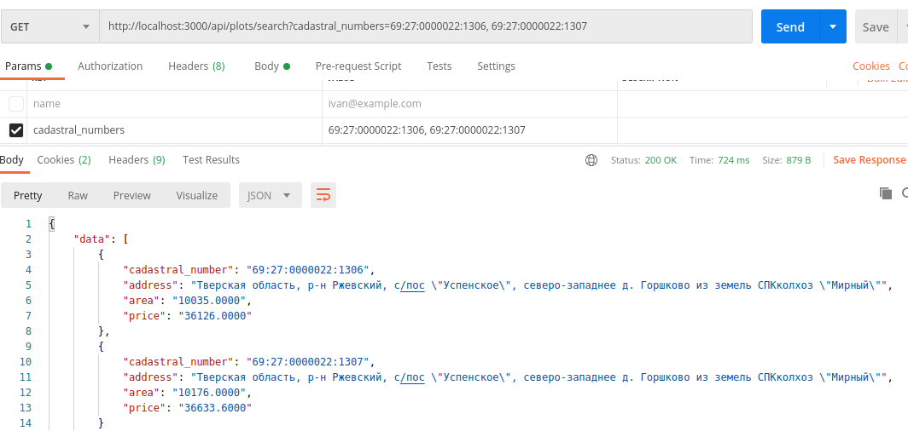
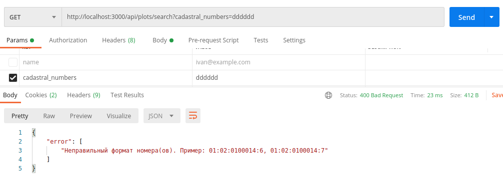
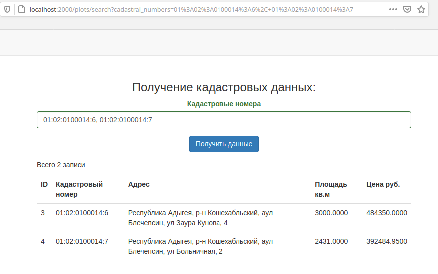
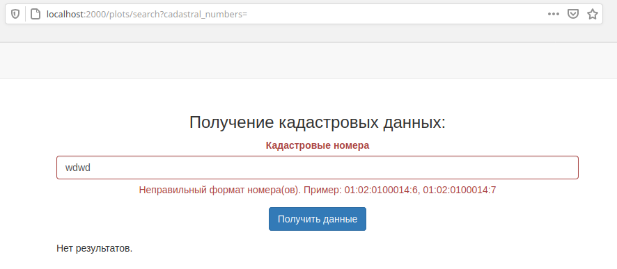
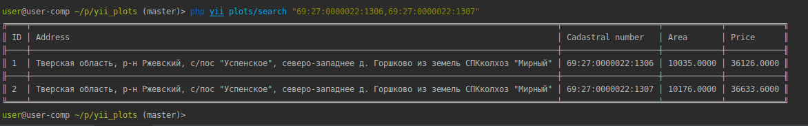
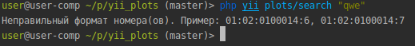

<h4>Установка проекта:</h4>

Выполнить команды:
```
git clone git@github.com:nsbln-rafael/yii_plots.git
composer install (в корне проекта)
composer install (в папке linters)
php init
```
Настроить подключение к базе данных(+ тестовое окружение) и выполнить команды:
```
php yii migrate
php yii_test migrate
```
Запустить тесты можно с помощью команды:
```
vendor/bin/codecept run -- -c common
```

Запуск frontend приложения:
```
php yii serve --docroot=frontend/web --port=2000
```

Запуск backend приложения:
```
php yii serve --docroot=backend/web --port=3000
```
Выполнение команды поиска участков в консоли:
```
 php yii plots/search "69:27:0000022:1306,69:27:0000022:1307"
```


API: Результат выполнения верной команды: 
```
http://localhost:3000/api/plots/search?cadastral_numbers=69:27:0000022:1306, 69:27:0000022:1307
```


API: Результат выполнения команды с ошибкой: 
```
http://localhost:3000/api/plots/search?cadastral_numbers=dddddd
```


***

FRONTEND: Результат выполнения верной команды: 
```
http://localhost:2000/plots/search?cadastral_numbers=01:02:0100014:6, 01:02:0100014:7
```


FRONTEND: Результат выполнения команды с ошибкой: 
```
http://localhost:3000/api/plots/search?cadastral_numbers=wdwd
```


***

CONSOLE: Результат выполнения верной команды: 
```
php yii plots/search "69:27:0000022:1306,69:27:0000022:1307"
```


CONSOLE: Результат выполнения команды с ошибкой: 
```
php yii plots/search "qwe"
```


***
